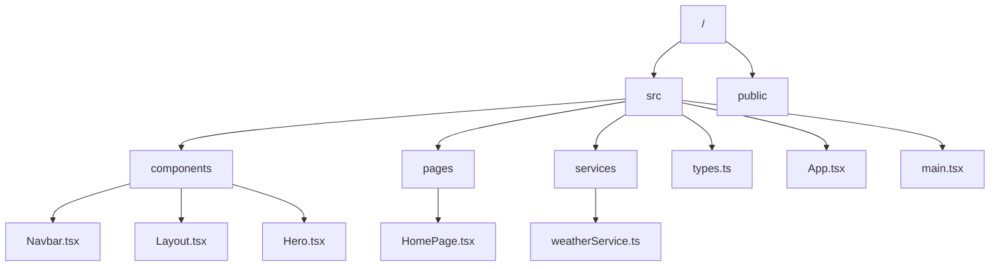
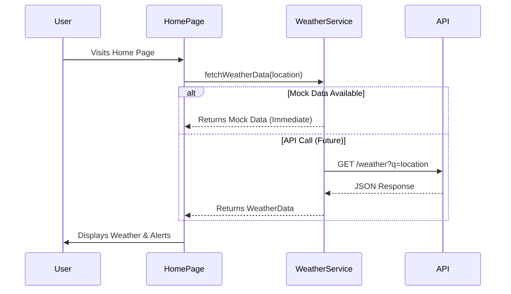

# Architecture Documentation

## File Structure

## Call Flow: Weather Data Fetching

## Data Flow

1.  **User Interaction**: User selects a location or lands on the home page.
2.  **Service Call**: Component calls `weatherService.fetchWeatherData(location)`.
3.  **Data Retrieval**: Service checks `stateData` (mock data) for the location.
4.  **Transformation**: Raw data (rain, temp, hazard) is transformed into `WeatherData` object with `CurrentWeather`, `Forecast`, and `Alert` objects.
5.  **Rendering**: Components receive `WeatherData` and render the UI.
